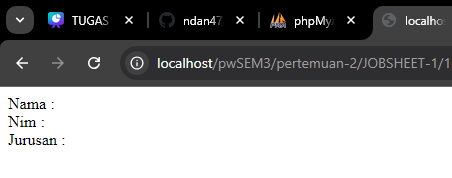
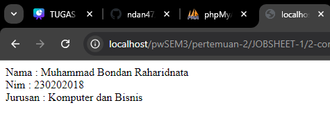
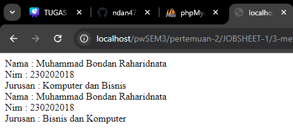
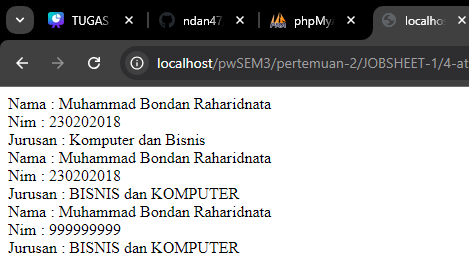
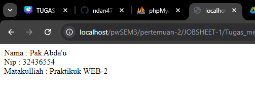

# Kelas dan Objek

Penggunaan kelas dan objek adalah inti dari pemrograman berorientasi objek
(OOP). Dalam PHP, kelas digunakan untuk mendefinisikan struktur dan perilaku objek, sedangkan objek adalah instansiasi dari kelas tersebut. Dengan memanfaatkan kelas dan objek, kode dapat diorganisir dengan lebih baik, lebih mudah dipelihara, dan dapat digunakan kembali.

## Class and Object

```php
<?php
// definisi kelas 
class Mahasiswa {
    // attribute atau properti 
    public $nama;
    public $nim;
    public $jurusan;

    // metode atau function 
    public function tampilkanData() {
        return "Nama : $this->nama <br>Nim : $this->nim <br>Jurusan : $this->jurusan</br    >";
    }
}

// instansi objek 
$mhs = new Mahasiswa("Muhammad Bondan Raharidnata", "230202018", ">Komputer dan Bisnis");
echo $mhs->tampilkanData();

?>
```

## Constructor
```php
<?php
// definisi kelas 
class Mahasiswa {
    // attribute atau properti 
    public $nama;
    public $nim;
    public $jurusan;

    // metode atau function 
    public function tampilkanData() {
        return "Nama : $this->nama <br>Nim : $this->nim <br>Jurusan : $this->jurusan";
    }

    // constructor
    public function __construct($nama, $nim, $jurusan) {
    $this->nama = $nama;
    $this->nim = $nim;
    $this->jurusan = $jurusan;
    }
}

// instansi objek 
$mhs = new Mahasiswa("Muhammad Bondan Raharidnata", "230202018", "Komputer dan Bisnis");
echo $mhs->tampilkanData();

?>
```


## Metode Tambahan

```php
<?php
// definisi kelas 
class Mahasiswa {
    // attribute atau properti 
    public $nama;
    public $nim;
    public $jurusan;

    // metode atau function 
    public function tampilkanData() {
        return "Nama : $this->nama <br>Nim : $this->nim <br>Jurusan : $this->jurusan</br>";
    }

    public function updateJurusan($jurusan) {
        $this->jurusan = $jurusan;
    }

    // constructor
    public function __construct($nama, $nim, $jurusan) {
    $this->nama = $nama;
    $this->nim = $nim;
    $this->jurusan = $jurusan;
    }
}

// instansi objek 
$mhs = new Mahasiswa("Muhammad Bondan Raharidnata", "230202018", "Komputer dan Bisnis");
echo $mhs->tampilkanData();
$mhs->updateJurusan("Bisnis dan Komputer");
echo $mhs->tampilkanData();

?>
```


## Penggunaan Attribute dan Metode
```php
<?php
// definisi kelas 
class Mahasiswa {
    // attribute atau properti 
    public $nama;
    public $nim;
    public $jurusan;

    // metode atau function 
    public function tampilkanData() {
        return "Nama : $this->nama <br>Nim : $this->nim <br>Jurusan : $this->jurusan</br>";
    }

    public function updateJurusan($jurusan) {
        $this->jurusan = $jurusan;
    }

    // constructor
    public function __construct($nama, $nim, $jurusan) {
    $this->nama = $nama;
    $this->nim = $nim;
    $this->jurusan = $jurusan;
    }

    // metode atau function setter untuk properti atau attribute nim
    public function setNim($nim) {
        $this->nim = $nim;
    }
}

// instansi objek 
$mhs = new Mahasiswa("Muhammad Bondan Raharidnata", "230202018", "Komputer dan Bisnis");
echo $mhs->tampilkanData();
$mhs->updateJurusan("BISNIS dan KOMPUTER");
echo $mhs->tampilkanData();
$mhs->setNIm("999999999");
echo $mhs->tampilkanData(); 
?>
```


## Tugas Mandiri 2
```php
<?php
// definisi kelas 
class Dosen {
    // attribute atau properti 
    public $nama;
    public $nip;
    public $mataKuliah;

    // metode atau function 
    public function tampilkanDosen() {
        return "Nama : $this->nama <br>Nip : $this->nip <br>Matakulliah : $this->mataKuliah</br>";
    }

    // constructor
    public function __construct($nama, $nip, $mataKuliah) {
        $this->nama = $nama;
        $this->nip = $nip;
        $this->mataKuliah = $mataKuliah;
    }
}

// instansiasi objek
$dosen = new Dosen("Pak Abda'u", "32436554", "Praktikuk WEB-2");
echo $dosen->tampilkanDosen();
?>
```

